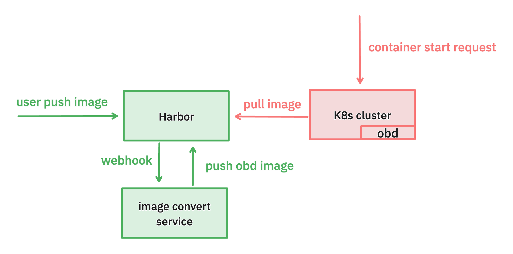

# How to accelerate the startup of a large Docker image?

In the previous article, we discussed the way to reduce the size of the Docker image. In this article, we will discuss how to accelerate the
startup of a large Docker image without reducing the size of it.

## Containerd Snapshotter Plugin

The startup time of a container is mainly determined by the time [pull the image and extract the image](https://medium.com/nttlabs/startup-containers-in-lightning-speed-with-lazy-image-distribution-on-containerd-243d94522361).

So can we pull the image lazily? Can we only download the necessary layers of the image? In the above article, the author mentioned that the
containerd snapshotter plugin can help us to achieve this goal.

- Snapshotter is an interface that contains the methods for `mount` system call.
  - Each layer of an image and every container corresponds to a snapshot.
  - Snapshot likes a chain which can have a parent snapshot.
  - During image pulling, where layers are decompressed from bottom to top.
  - When running a container, to construct the container’s `rootfs`.
- Remote Snapshotter: Containerd allows snapshotters to reuse snapshots existing somewhere managed by them.
- Reformat the layers of the image to make it addressable by the remote snapshotter.
- The remote snapshotter can download the layers on-demand.

## Different Snapshotter Plugins

In the containerd, there are several snapshotter plugins available.

- [stargz-snapshotter](https://github.com/containerd/stargz-snapshotter): A snapshotter plugin that supports the stargz format.
- [nydus-snapshotter](https://github.com/containerd/nydus-snapshotter): A snapshotter plugin that supports the Nydus format.
- [overlaybd-snapshotter](https://github.com/containerd/accelerated-container-image): A snapshotter plugin that supports the overlaybd format.

Stargz and Nydus are two popular snapshotter plugins that have been widely used in the industry. But for me, I am more interested in the OverlayBD.
It is more deployable that can be easily integrated with the existing containerd. In my production environment, I have already used the OverlayBD.
The image which is more than 50GB can be started in 1 second, which is amazing. Of course, the startup time is also related to the network bandwidth.

## Troubleshooting

- If you have some containers that are started before the OBD plugin is installed, you need to remove the images and then re-pull them.
- If you have private registries, you need to configure the `config.json`, `cred.json` and `containerd/config.toml` files.

# References
1. https://dev.to/napicella/what-is-a-containerd-snapshotters-3eo2
2. https://medium.com/nttlabs/startup-containers-in-lightning-speed-with-lazy-image-distribution-on-containerd-243d94522361
3. https://github.com/containerd/containerd/blob/main/docs/remote-snapshotter.md

# Off-topic

I am so sorry that I have not written any articles for a long time. I have been busy with matters related to move to Canada. I have just settled
down here. Thank you for your patience. I will write more articles in the future.
