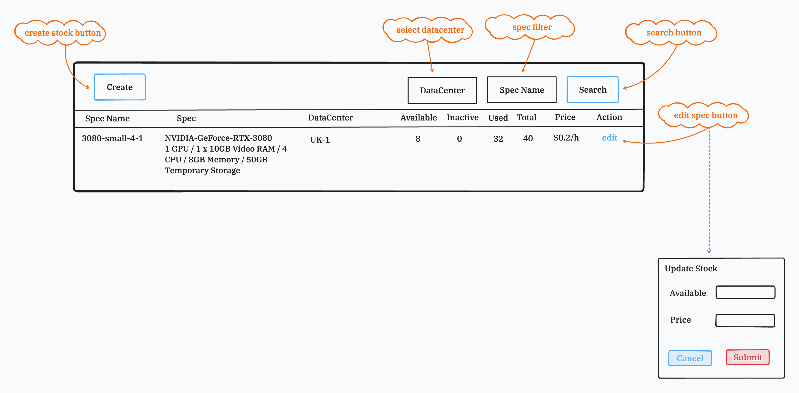
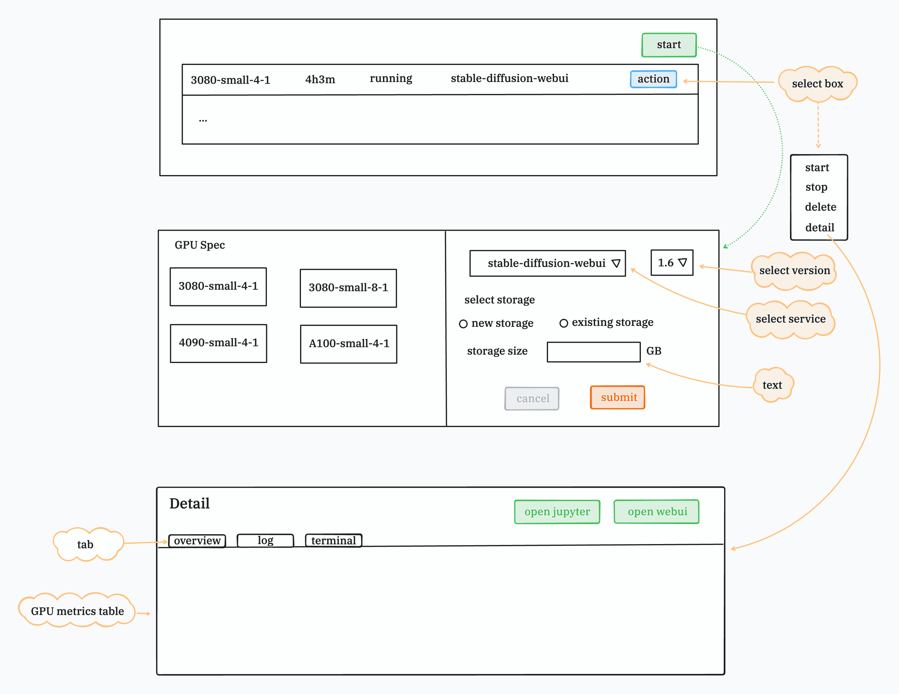
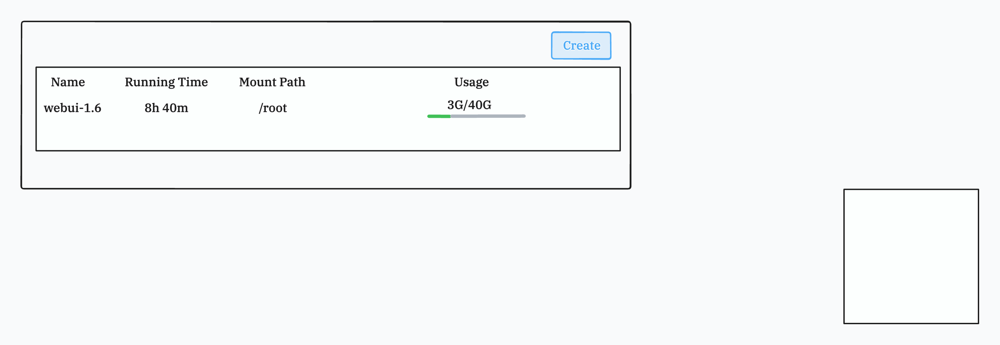

## Building a GPU SaaS Platform

As we discussed in the previous article, we will write a requirement document for our Stable Diffusion WebUI SaaS. This article is not a complete requirement document, but a guide to write a requirement document.

### Background

AI drawing technology has been widely used in many fields, such as game design, animation, video processing, etc. However, it is really hard for
designers to prepare the environment to use the technology. Therefore, we want to build a Stable Diffusion WebUI SaaS for designers.

**Note**: It is important to explain why we want to do this, and who will be our users.

#### Game materials

In the game design field, designers need to prepare a lot of materials, such as characters, scenes, etc. In a common way, the PM will ask the
designer to draw some materials, but it is hard to satisfy the PM's requirement in one time. So, the designer needs to draw the materials again and again.
By using the Stable Diffusion WebUI, the designer can generate the materials automatically, then modify them to satisfy the PM's requirement. So, the designer can save a lot of time.

#### Lora training

In the animation field, the Lora training is a time-consuming task. The Stable Diffusion WebUI can help the animator to train the Lora model easily.

**Note**: It is good to explain the use cases of the platform.

### Description of the project

#### Overall description

1. **Functional requirements**

- **stock management**: the platform should provide a stock management service for administrators.
- **GPU service management**: the platform should provide a GPU service management service for users.
- **Storage service management**: the platform should provide a storage service management service for users.

2. **Non-functional requirements**

- **tenant isolation**: the platform should provide tenant isolation for users.
- **distributed resource management**: the GPU service and storage service should be distributed.
- **security**: users' data should be secure, and users can only access their own data.
- **services should be independent**: the stock management, GPU service management, and storage service management should be independent.
- **high availability**: the platform should be highly available, SLA 99.99%.
- **high performance**: the platform should have high performance, the response time should be less than 100ms.

#### Concept definition

- **GPU Specification**: the GPU specification includes the GPU model, the number of GPU cores, the number of CPU cores, the memory size, the disk
  size and the price.
- **GPU Instance**: the GPU instance is a running instance of the GPU service.
- **Storage Specification**: the storage specification includes the storage size, and the price.
- **Storage**: the storage is an independent volume that can be mounted to the GPU instance.
- **GPU Instance Disk**: the GPU instance disk is the disk of the GPU instance which is included in the GPU instance.

### Specific requirements

#### stock management

- **user operation flow**

1. The administrator can add a new GPU specification.
2. The administrator can delete a GPU specification.
3. The administrator can add a stock of a GPU specification.
4. The administrator can delete a stock of a GPU specification.
5. The administrator can list the stocks.
6. The administrator can search the stocks by spec name.

- **business flow**

There will be two planes, the GPU management plane and the runtime plane. The GPU management plane should support the CRUD of the GPU
specification and the stock. The runtime plane should manage the real stock resources and report the stock status to the GPU management plane.

1. The stock management service should support creating a bulk of same GPU specification stocks.
2. The stock management service should support deleting a bulk of same GPU specification stocks.
3. The stock management service should support listing the stock status.
4. The stock management service should support API for CRUD of the GPU specification and the stock.

#### GPU service management

- **user operation flow**

1. The user can create a GPU instance with a GPU specification, stable diffusion webui version, and storage.
2. The user can delete a GPU instance.
3. The user can list the GPU instances.
4. The user can start a GPU instance, and in the detail page, the user can access the webui.
5. The user can stop a GPU instance.
6. In the detail page, the user can see the GPU instance status, GPU monitoring, terminal, and logs.

- **business flow**

The GPU management plane is responsible for managing the GPU life cycle and cost. The runtime plane is responsible for managing the real GPU
resources, reporting the GPU status to the GPU management plane and starting the webui service.

1. The GPU service management service should support creating a GPU instance.
2. The GPU service management service should support deleting a GPU instance.
3. The GPU service management service should support listing the GPU instances status.
4. The GPU service management service should support API for CRUD of the GPU instance.

#### Storage service management

- **user operation flow**

1. The user can create a storage with a storage specification.
2. The user can delete a storage.
3. The user can list the storages.
4. The user can access UI for the storage.

- **business flow**

The storage management plane is responsible for managing the storage life cycle and cost. The runtime plane is responsible for managing the real storage resources and reporting the storage status to the storage management plane.

1. The storage service management service should support creating a storage.
2. The storage service management service should support deleting a storage.
3. The storage service management service should support listing the storage status.
4. The storage service management service should support API for CRUD of the storage.
5. The storage service management service should support access UI for the storage.

### Overall

It is a good practice to write a requirement document before starting to write the code. The requirement document should be detailed enough to let
the developers understand what they should do. It should also be flexible enough to let the developers have some space to design the architecture
and choose the technologies. In the next article, we will discuss the architecture of the platform, and choose the technologies, and write a
design spec. **However, the article is a demo, not enough detailed to be a real requirement spec.**
