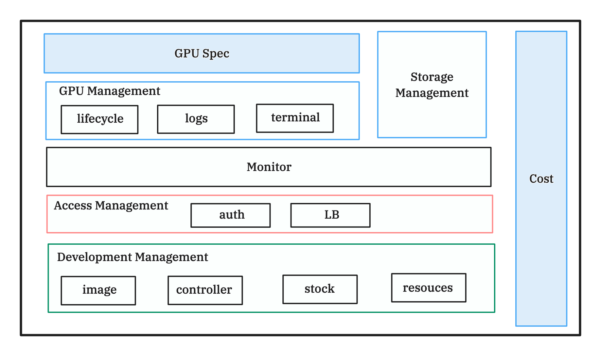
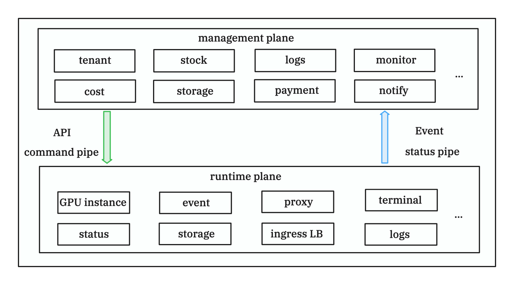
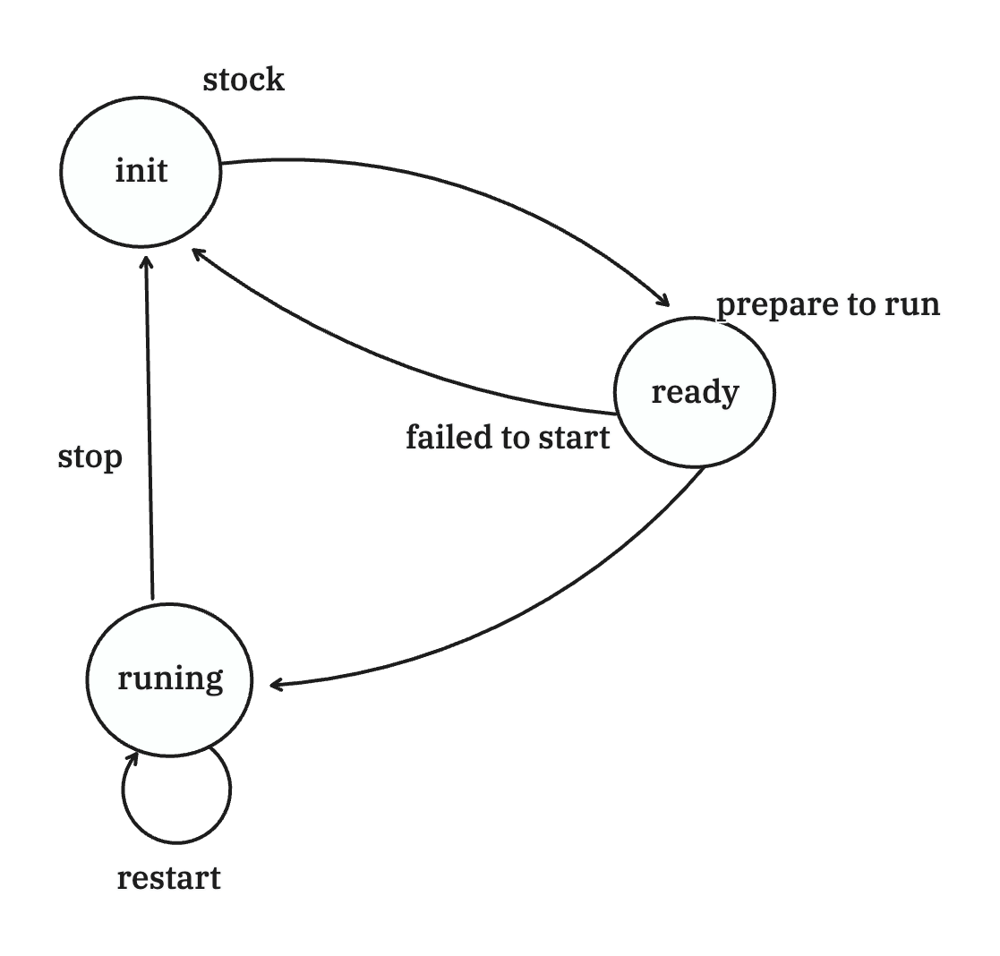

# Building a GPU SaaS Platform

Depending on the requirements of the application, the container technology would be a good choice for us. We could choose Docker or Kubernetes. We
could also use Block Storage, Object Storage, or File Storage, such as OpenEBS, MinIO, or Ceph. We could also use a cloud provider, such as AWS,
Azure, or GCP. So, how do we choose the right technology for our GPU SaaS platform? Let's discuss it.

## Technology Choices

### Container Technology

#### Docker

- Pros
  - Easy to use, easy to operate
  - Flexible, we can use it for any requirements
- Cons
  - Not suitable for large-scale applications
  - We need to implement our own orchestration system, management the lifecycle of containers, and so on

#### Kubernetes

- Pros
  - Scalable, we can use it for large-scale applications
  - It has a lot of features, such as auto-scaling, self-healing, and so on
- Cons
  - Complex, we need to learn a lot of things

Depending on the workload, and human resources, I choose Kubernetes.

### Storage Technology

|                      | MinIO    | OpenEBS（jiva） | Rook(Ceph)          |
|----------------------|----------|---------------|---------------------|
| support of community | No       | yes           | yes                 |
| storage type         | Object   | Block         | Block, Object, File |
| deployment           | Easy     | Easy          | Easy                |
| operation            | Easy     | Complex       | Complex             |
| PVC auto-provision   | directPV | yes           | yes                 |
| IOPS                 |          |               |                     |
| Big Data I/O         |          |               |                     |
| scheduling cost      |          |               |                     |

For our scenario

- the user need to store the model data which is large, around 10GB.
- there will be many small files, around 100000 files for each user.
- each user will have multiple storages.

As you see above, there are some empty cells. We need to do some experiments to fill them. I will write another article about it. However, I could
tell you that Ceph is the best choice for us.

### Other Technology

There are many frameworks for our scenario, such as Kubeflow, JupyterHub, and so on. But, in this article, I would like to focus on how to develop
a GPU SaaS platform, so I will not discuss them.

## Design Spec

### Architecture

#### Functional Architecture

#### Technical Architecture

In this series, I will only focus on the runtime plane. I will not discuss the control plane, such as the management of users.

### Runtime Plane

I will use Kubernetes Operator to manage the lifecycle of the GPU instances. For MVP, I will only discuss one cluster. However, in the future,
when we need to scale out, I will discuss how to manage multiple clusters. So, let's discuss the runtime plane.

- Ingress: control the access to the GPU instances, each user will have a unique URL to access their GPU instances.
- Reverse Proxy: manage the access to the GPU instances, such as load balancing, authentication, and so on.
- GPU Controller: manage the lifecycle of the GPU instances, such as create, delete, and so on.
- Storage Service: manage the storage service, such as upload, download, and so on.

#### GPU instance state

- init: stock state, locks resources
- ready: user starts the instance, but the readiness probe is not ready
- running: the readiness probe is ready, the user can access the instance

#### Create Stocks of GPU instances

```mermaid
sequenceDiagram
title: Create stocks

mgmt service->>dispatcher: create stocks
dispatcher->>distributed lock: require lock
distributed lock-->>dispatcher: auth lock
dispatcher->>status center: require remaining resources
status center-->>dispatcher: remaining resources
dispatcher->>operator: create stocks
dispatcher->>distributed lock: release lock
operator-->>status center: stock statistic & remain resouces
operator-->>dispatcher: stocks event
dispatcher-->>mgmt service: response event
```

#### User starts the GPU instance with the storage

#### Operator API

- Create Stocks
- Delete Stocks
- Start GPU instance
- Stop GPU instance
- GPU instance state

#### Storage Service API

I would not discuss the design of the storage service in this article. However, I would list the API of the storage service.

- Create Storage
- Delete Storage
- Update Storage
- Create Storage Accessor
- Delete Storage Accessor

