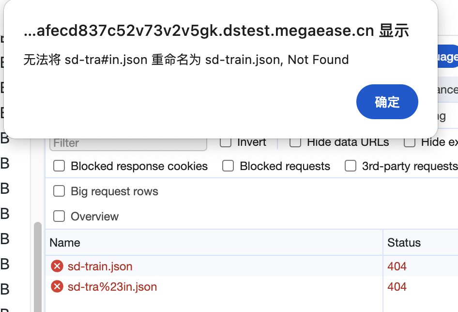
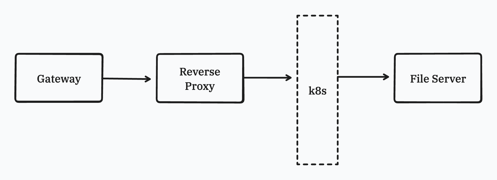

## A Fun "Bug" with Golang's http.URL

I recently encountered an interesting issue that I thought the steps I took to troubleshoot might be worth sharing. I use an open-source project
called [dufs](https://github.com/sigoden/dufs) as a file server for my users. I found that I can't operate a file which name contains `#` and `?`,
and I am sure that I've encoded the URL correctly.

### Prepare the minimal environment



First, I queried the server logs

```text
2024-02-20T01:53:41Z INFO - 10.233.64.42 "HEAD /files/qsdizt-1703128686-ca6addedebab4017/sd-train.json" 404
2024-02-20T01:53:41Z INFO - 10.233.64.42 "MOVE /files/qsdizt-1703128686-ca6addedebab4017/sd-tra" 404
```

The first log is a `HEAD` request which represents whether the destination file exists. The second log is a `MOVE` request which represents moving
the source file to the destination file. It is obvious that the request URL is wrong. I run the same request in my local environment(MacOS) and it
works. But the server is running in a container with MUSL. So I need to prepare a minimal environment to make sure whether it is a MUSL issue.

```rust
pub type Request = hyper::Request<Incoming>;

pub async fn handle(self: Arc<Self>, req: Request) -> Result<Response> {
  let req_path = req.uri().path();
  ...
}
```

I wrote a simple Rust program to simulate the server. The server will print the request URL and the request URL is correct. So it is not a MUSL
issue. And I've found it is ok to use other non-ASCII characters in the file name. Suddenly, I realized that the `#` and `?` are special
characters in the URL.

### The root cause



The architecture of the server is shown in the figure. In front of the server, there is an open-source gateway called [easegress](https://github.
com/easegress-io/easegress) and a self-developed reverse proxy.

* The gateway is responsible for handling the request from the client and forwarding the request to the different server, like terminal server, console
  server, etc.
* The reverse proxy is responsible for authenticating the request and finding the real pod to handle the request.

Both of them are written in Golang. So I need to find which part decodes the URL.

In the reverse proxy, I found the following code:

```go
func buildReverseProxyCallback(resp http.ResponseWriter, req *http.Request, wcap *model.WebConsoleAccessParams) tunnel.SSHTunnelCallback {
	director := func(req *http.Request) {
		req.URL.Scheme = wcap.Protocol
		req.URL.Host = fmt.Sprintf("%s:%d", wcap.Host.HostIP, wcap.Port)
	}
	var proxyError error = nil
	errorHandler := func(resp http.ResponseWriter, req *http.Request, err error) {
		proxyError = err
		log.Printf("[GPUConsole] http: proxy error: %v", err)
		resp.WriteHeader(http.StatusBadGateway)
	}
	return func(dia tunnel.Dial, sshClient *ssh.Client) error {
		reverseProxy := &httputil.ReverseProxy{Director: director, ErrorHandler: errorHandler}
		myTransport := http.DefaultTransport.(*http.Transport).Clone()
		myTransport.TLSClientConfig = &tls.Config{InsecureSkipVerify: true}
		if dia != nil {
			myTransport.DialContext = nil
			myTransport.Dial = dia
		}
		reverseProxy.Transport = myTransport
		reverseProxy.ServeHTTP(resp, req)
		return proxyError
	}
}
```

The `director` function is responsible for setting the `req.URL.Scheme` and `req.URL.Host`. It doesn't decode the URL. So the issue is not in the
reverse proxy.

So I checked the gateway. The gateway is a bit complex. It has a lot of features, like rate limiting, authentication, etc. And I couldn't find
something contains `escape` or `unescape` in the code. So I decided to deploy a minimal http server to mock the production environment.

```yaml
- https: false
  keepAlive: true
  keepAliveTimeout: 75s
  kind: HTTPServer
  maxConnections: 10240
  name: http-server-gpu-proxy
  port: 80
  rules:
    - paths:
        - backend: web-console-proxy
          clientMaxBodySize: -1
          pathPrefix: /
  version: easegress.megaease.com/v2
- filters:
    - kind: Proxy
      name: proxy
      pools:
        - loadBalance:
            policy: roundRobin
          serverMaxBodySize: -1
          servers:
            - url: http://10.108.162.15:38801
  flow:
    - filter: proxy
  kind: Pipeline
  name: web-console-proxy
```

Then I executed the following command:

```bash
curl http://localhost/files/qsdizt-1703128686-ca6addedebab4017/sd-tr%23ain.json
```

The server printed the following log:

```text
Feb 19 17:12:31 ds15 easegress-server[309509]: 2024-02-19T17:12:31.999Z        INFO Get /files/qsdizt-1703128686-ca6addedebab4017/sd-tr#ain.json
```

The URL is decoded, so I read the source code of the gateway again. I found the following code:

```go
func (spCtx *serverPoolContext) prepareRequest(svr *Server, ctx stdcontext.Context, mirror bool) error {
	req := spCtx.req

	url := svr.URL + req.Path()
	if rq := req.Std().URL.RawQuery; rq != "" {
		url += "?" + rq
	}
  ...
}

// Path returns path.
func (r *Request) Path() string {
	return r.Std().URL.Path
}
```

And I read the [document](https://pkg.go.dev/net/url#URL) of the `http.URL`

```text
Note that the Path field is stored in decoded form: /%47%6f%2f becomes /Go/. A consequence is that it is impossible to tell which slashes in the Path were slashes in the raw URL and which were %2f. This distinction is rarely important, but when it is, the code should use the URL.EscapedPath method, which preserves the original encoding of Path.

The RawPath field is an optional field which is only set when the default encoding of Path is different from the escaped path. See the EscapedPath method for more details.
```

So the issue is in the gateway. The `Path` method decodes the URL. But why Golang decodes the URL? In rust and python Flask, the URL is not
decoded. The important thing is that the `Path` documentation doesn't mention it. I think the documentation should be
improved. In my opinion, the reason why Golang decodes the URL is that it is convenient for the developer, in most cases, the developer doesn't
need the original encoding of the URL.

